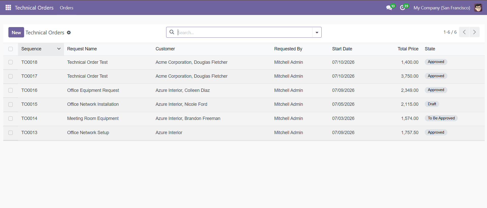
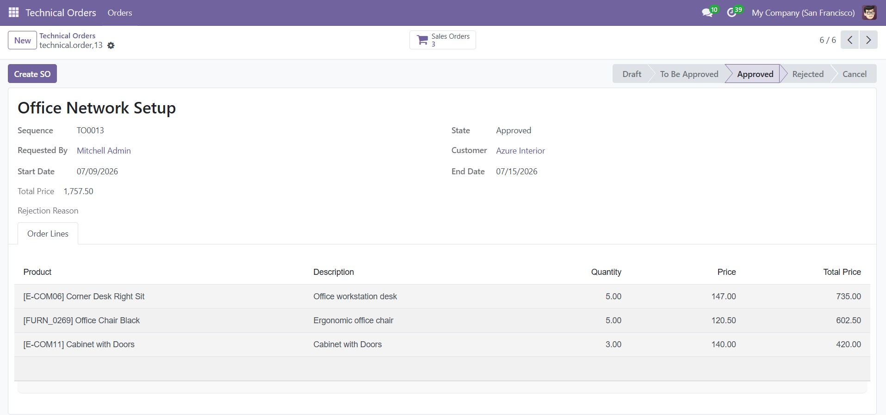
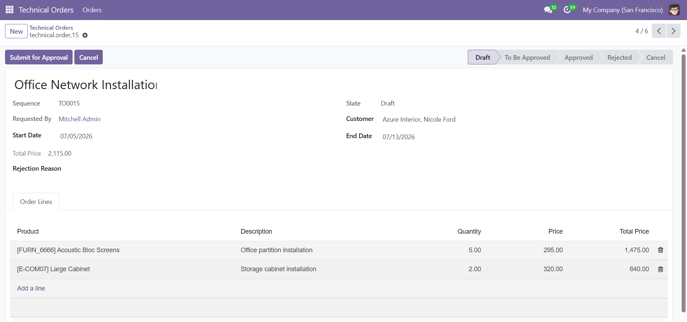
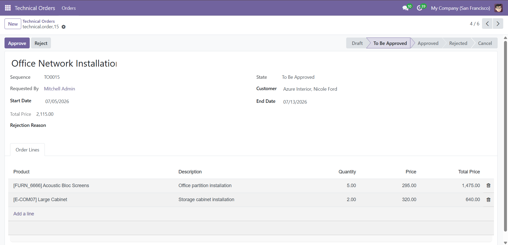
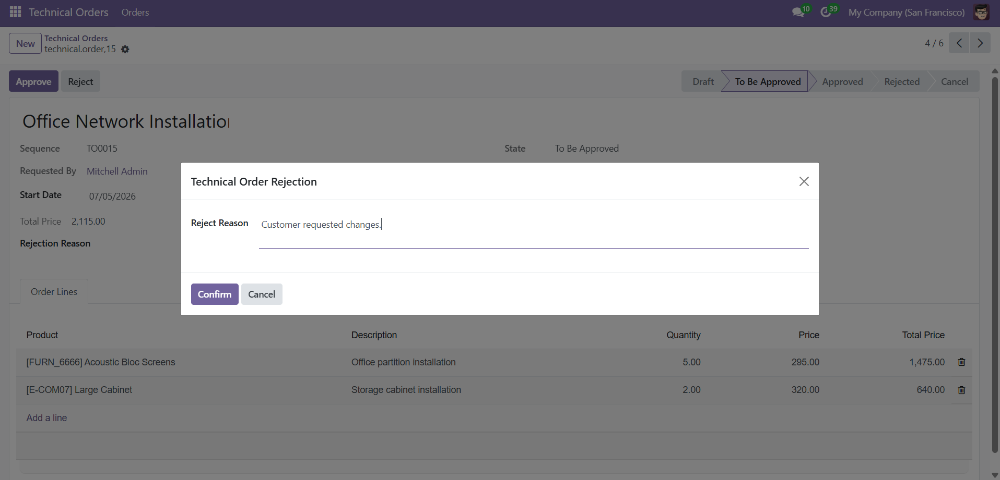
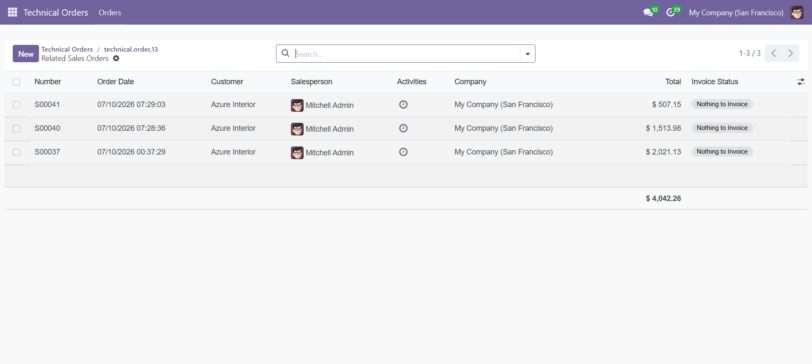
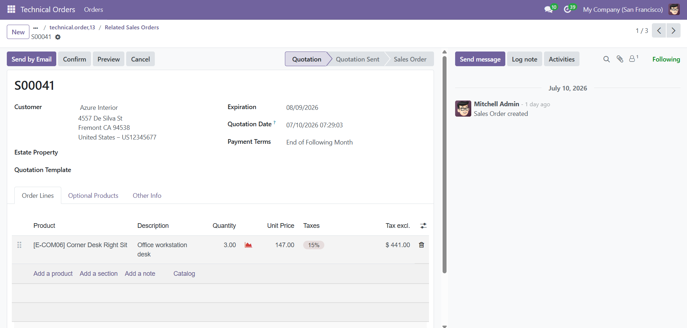
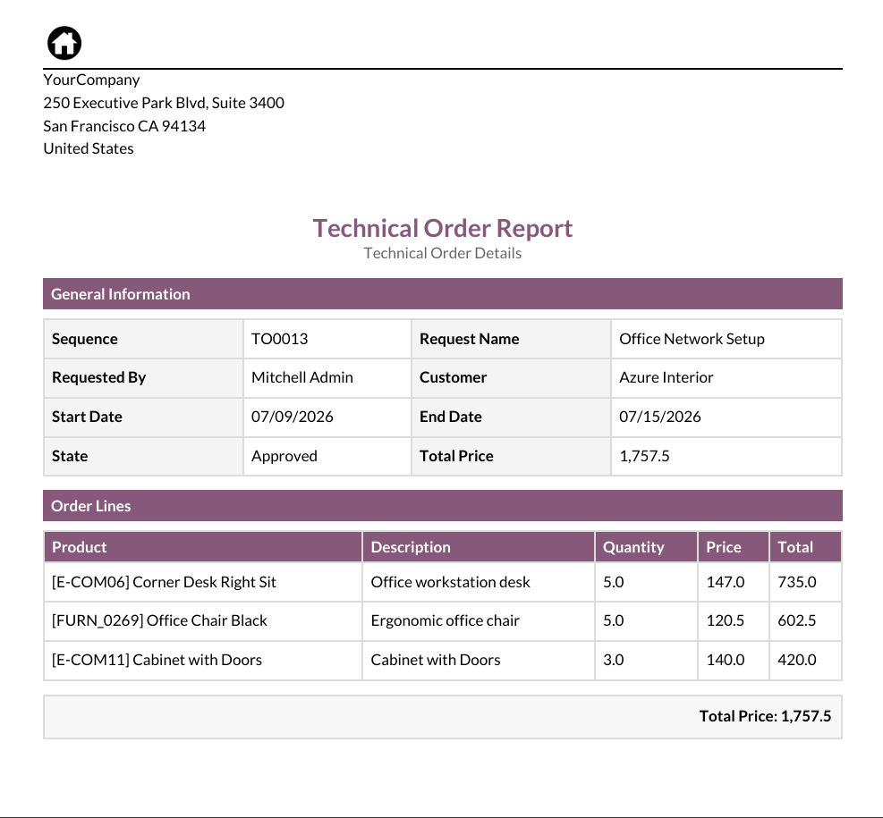

# # Technical Order

A custom Odoo 17 module developed for a **Wooden Tools Store** to manage customer technical requests before converting them into Sales Orders.

---

# Overview

The client needed a system that allows employees to register customer requests before creating Sales Orders.

Instead of generating Sales Orders directly, each request goes through an approval process to ensure that requested products and quantities are reviewed before entering the sales cycle.

This module introduces a complete **Technical Order Workflow** integrated with Odoo Sales.

---

# Business Scenario

A **Wooden Tools Store** receives customer requests for different wooden products.

Each request contains:

- Customer information
- Requested products
- Requested quantities
- Prices
- Request period

Before creating a Sales Order, the request must be reviewed and approved.

Once approved, Sales Orders can be generated while ensuring that the ordered quantity never exceeds the approved requested quantity.

---

# Features

## Business Features

- Create Technical Orders
- Manage Customer Requests
- Approval Workflow
- Reject Requests with Reason
- Generate Sales Orders from Approved Requests
- Support Multiple Sales Orders for the Same Technical Order
- Track Related Sales Orders
- Print Technical Order PDF Report

---

## Technical Features

- Automatic Sequence Generation
- Computed Fields
- One2many / Many2one Relationships
- Python Constraints
- Onchange Methods
- Smart Button
- Statusbar Workflow
- Wizard
- QWeb PDF Report
- Email Notification
- Sale Order Integration
- Sale Order Line Validation

---

# Workflow

```text
Draft
   │
   ▼
Submit for Approval
   │
   ▼
To Be Approved
   ├──────────────► Reject
   │                     │
   ▼                     ▼
Approve              Rejected
   │
   ▼
Approved
   │
   ▼
Create Sales Order
   │
   ▼
Related Sales Orders
```

---

# Business Rules

- End Date cannot be earlier than Start Date.
- Product quantity must be greater than zero.
- Sales Orders can only be generated from approved Technical Orders.
- Ordered quantities cannot exceed the approved requested quantity.
- The **Create SO** button automatically disappears once all requested quantities have been ordered.
- Sales Managers receive an email notification after approval.

---

# Screenshots

## Technical Orders List



---

## Technical Order Form



---

## Draft State



---

## Approval Workflow



---

## Reject Wizard



---

## Generated Sales Order



---

## Related Sales Orders



---

## Technical Order PDF Report



---

# Module Structure

```
technical_order
│
├── data
├── models
├── reports
├── screenshots
├── security
├── views
├── wizard
├── __manifest__.py
└── README.md
```

---

# Technologies

- Odoo 17
- Python
- PostgreSQL
- XML
- QWeb Reports

---

# Author

**Muhamed Helmy**

Backend Developer | Odoo Developer